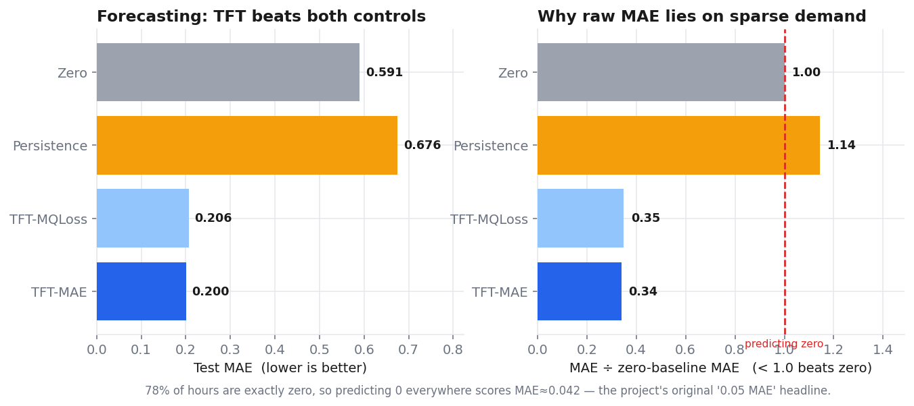
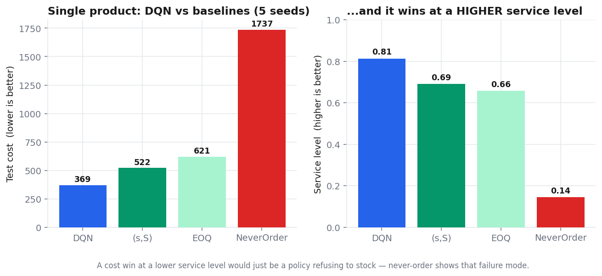
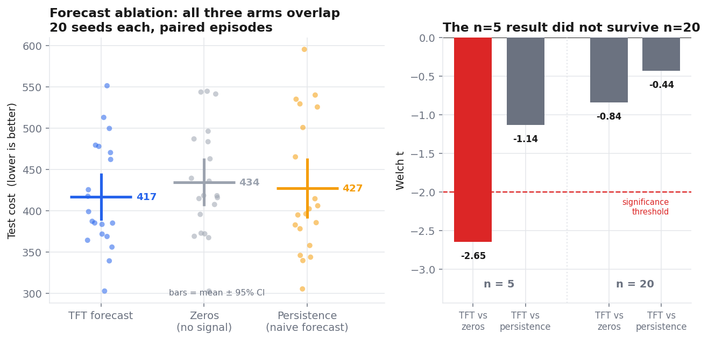
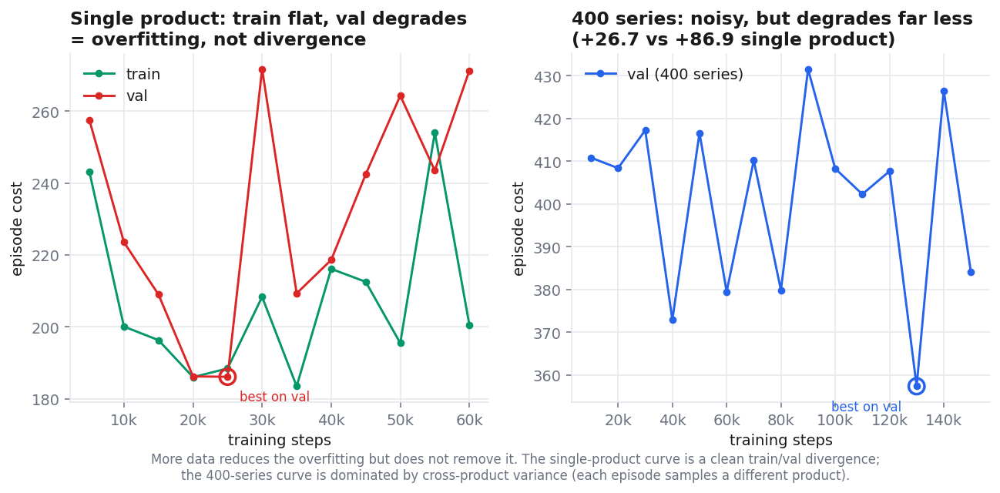

# StockSmart — Transformer Forecasting + Deep RL for Inventory Restocking

Demand forecasting (Temporal Fusion Transformer) feeding a DQN restocking agent, on
**FreshRetailNet-50K** — 4.85M rows of real hourly retail sales.

The interesting part of this project is not the architecture. It is that the original
headline metric turned out to be measuring nothing, and rebuilding the evaluation
surfaced defects at every stage — **17 decisions documented in
[`decisions.md`](decisions.md)**, including two data leaks that were inflating the
results. Every number below is what survived that.

---

## Results

### Forecasting works



| Model | Test MAE | vs predicting zero | vs lag-24 |
|---|---|---|---|
| **TFT** | **0.2005** | **0.34×** | **0.30×** |
| Persistence (lag-24) | 0.6755 | 1.14× | 1.00× |
| Zero | 0.5905 | 1.00× | 0.87× |

175,700 held-out test rows, 502 series, walk-forward evaluation.

> **Why the zero baseline matters.** 78% of hours are exactly zero, so predicting `0`
> everywhere scores MAE ≈ 0.042. That is what this project's original **"0.05 MAE"**
> headline was. Raw MAE on intermittent demand measures sparsity, not skill — note that
> predicting zero *beats* the lag-24 baseline here.

### The DQN beats classical policies



| Policy | Test cost | Service level |
|---|---|---|
| **DQN** | **368.7** | **0.813** |
| (s,S), tuned on val | 521.5 | 0.690 |
| EOQ | 620.9 | 0.657 |
| Never order | 1737.2 | 0.145 |

**+29.3% lower cost on 5/5 seeds**, at a *higher* service level — so it is not buying
cost savings by refusing to stock. Baselines are tuned on validation and scored on test
exactly like the agent.

### But the transformer forecast does not measurably help the agent



| Arm | Test cost | ± sd | vs TFT |
|---|---|---|---|
| **TFT forecast** | **416.9** | 65.2 | — |
| Persistence (naive) | 427.2 | 82.6 | t = −0.44, **n.s.** |
| Zeros (no signal) | 434.4 | 65.9 | t = −0.84, **n.s.** |

20 seeds per arm, paired episodes, three arms differing *only* in what fills the forecast
slots. **Neither comparison is significant.** You could feed the agent a naive forecast —
or zeros — and lose nothing measurable.

At n=5 this same experiment looked significant (t = −2.65). It did not survive n=20.
That false positive, and why it happened, is written up in
[`decisions.md` D17](decisions.md).

**Scope:** the agent sees *one causal day* of forecast (a leak fix collapsed the other
six slots), so this tests a 1-day TFT forecast against 1-day persistence — the hardest
case for a transformer. It does **not** show "forecasting doesn't help inventory RL."

### Training dynamics



Train stays flat while validation degrades → overfitting, not optimization divergence.
Diagnosed by instrumenting both splits rather than guessing, since the two need opposite
remedies. Cause: 61 training days at `episode_length=10` is ~51 distinct windows replayed
~118 times. Cure is more data, not hyperparameters — 400 series cuts degradation from
+86.9 to +26.7.

---

## What was wrong, and how it was found

Full record in **[`decisions.md`](decisions.md)** (17 decisions) and
**[`design.md`](design.md)** (narrative). Highlights:

| Defect | How it showed up |
|---|---|
| Row index scored as the forecast | `mae=inf`. NeuralForecast ≥3.2 changed output shape; `.reset_index()` injected an `index` column that `model_cols[0]` picked. Local version was 3.1.5, so it only appeared on the Studio |
| Forecast lookahead leak | 6 of 7 observation slots were conditioned on demand the agent had not seen. Closing it cut the shared-policy headline from 37.7% → 26.1% |
| `val_size` as a row count | NeuralForecast counts *per-series* timesteps; 502 series gave `1629 − 175198 = −173,569` and every TFT run failed |
| Unseeded evaluation | Baseline and agent scored on different random episodes; no number reproducible |
| Reconstruction leaked the future | A *later* day's sales changed an *earlier* day's reconstructed target |
| Never-ordering was optimal | `fixed=25` vs `stockout=5` made doing nothing correct for 21% of series |

Three protocol errors were also caught **while producing results**, each of which changed
the answer: tuning the baseline on test, reporting the last checkpoint instead of the
best, and `episode_length > split length` (which silently made all 40 "episodes"
identical).

## Known limitations

- **32.6% of the demand target is imputed** by a gradient-boosting model — the dataset
  records *sales*, not demand, so stockout hours are filled in. The forecaster is partly
  learning to predict another model's output. Structural; no code fix.
- **Effective sample size ≈ 6**, not 40 — a 15-day test split with 10-day episodes gives
  6 overlapping windows.
- **No forecast-driven base-stock baseline** — the natural consumer of a TFT, and the
  next comparison worth running.
- Results come from 502 of 50,000 series (≥5 units/day); `expand_to_hourly` uses
  `.iterrows()` and cannot scale to the full dataset.

## Reproducing

```bash
pip install -r requirements.txt
python -m pytest tests/ -q          # 32 tests
python scripts/make_figures.py      # regenerates images/ from artifacts/results/
```

Full pipeline (needs a GPU for the TFT stage) is documented in
[`execution.md`](execution.md). Result CSVs are committed under `artifacts/results/`, so
every number above is auditable without re-running anything.

## Architecture

```
FreshRetailNet-50K Dataset
        │
        ▼
┌─────────────────────┐
│  Data Processing     │  Demand reconstruction, feature engineering,
│  (data_processing)   │  temporal/lag/rolling/interaction features
└────────┬────────────┘
         │
         ▼
┌─────────────────────┐
│  Demand Forecasting  │  LSTM baseline + Temporal Fusion Transformer
│  (data_processing)   │  Quantile forecasts → state features for RL
└────────┬────────────┘
         │
         ▼
┌─────────────────────┐
│  RL Optimization     │  Per-category DQN agents (Stable-Baselines3)
│  (rl_optimization)   │  Single-product + per-category envs / Gymnasium
└─────────────────────┘
```

## Dataset

**FreshRetailNet-50K** from Hugging Face — hourly sales, stockout indicators, and rich contextual features for ~50K product-store combinations.

| Split | Rows | Description |
|-------|------|-------------|
| Train | 4.5M | Historical sales with covariates |
| Eval  | 350K | Held-out evaluation partition |

Key fields: `hours_sale`, `hours_stock_status`, `discount`, `holiday_flag`, `activity_flag`, weather variables, and full category hierarchy.

## Tech Stack

| Component | Technology |
|-----------|------------|
| Language | Python 3.9+ |
| RL Framework | Stable-Baselines3 (DQN) |
| Environment API | Gymnasium |
| Deep Learning | PyTorch |
| Transformer Models | PyTorch Lightning / Hugging Face Transformers |
| Genetic Algorithm | DEAP (optional, unvalidated) |
| Data Processing | Pandas, NumPy |
| Forecasting | NeuralForecast (LSTM, TFT) |
| MILP Baseline | Pyomo + GLPK |
| Visualization | Matplotlib, Plotly |
| Experiment Tracking | Weights & Biases |

## Project Structure

```
RL/
├── README.md
├── requirements.txt
├── artifacts/                        # Generated models and features
│   ├── hourly_features.parquet
│   ├── rl_forecast_features.parquet
│   ├── feature_scaler.pkl
│   ├── nf_lstm/
│   ├── nf_tft/
│   └── dqn_category_<id>/           # Per-category DQN models
├── data/
│   └── data_processing.ipynb        # Data processing + demand forecasting
└── rl_optimization.ipynb            # Per-category RL training + evaluation
```

## Setup

```bash
# Clone the repo
git clone <repo-url> && cd RL

# Create a virtual environment (recommended)
python -m venv venv && source venv/bin/activate

# Install dependencies
pip install -r requirements.txt

# Launch Jupyter
jupyter notebook
```

## Pipeline

### 1. Data Processing & Feature Engineering (`data/data_processing.ipynb`)

- Load FreshRetailNet-50K from Hugging Face
- Reconstruct latent demand during stockout periods
- Reshape daily rows with nested hourly sequences into long-format hourly table
- Engineer temporal, lag, rolling, interaction, and hierarchical features
- Standardize features and perform chronological train/val/test split

### 2. Demand Forecasting (`data/data_processing.ipynb`)

- **LSTM baseline**: 168-hour lookback, multi-step 24-hour forecast
- **Temporal Fusion Transformer (TFT)**: probabilistic quantile forecasts with attention-based interpretability
- Evaluate on MAE, RMSE and bias **against a zero baseline and lag-24 persistence**.
  On intermittent demand MAE is minimized by predicting zero, so a raw MAE figure is not evidence of skill — `rel_zero < 1.0` is the real gate
- Export point forecasts + prediction intervals as RL state features

### 3. RL Optimization (`rl_optimization.ipynb`)

Two environment types:

- **`InventoryEnv`**: single product-store environment for per-product evaluation
- **`CategoryInventoryEnv`**: multi-product environment that randomly samples a product-store from the category each episode, training the agent on diverse demand patterns

Per-category DQN training loop:

1. Select the top 5 product categories by number of product-store combinations
2. For each category, build a `CategoryInventoryEnv` with all its product-stores
3. Train a DQN agent (MlpPolicy, [256, 256], epsilon-greedy) on the category environment
4. Optionally seed the replay buffer with GA-evolved (s, S) trajectories (`USE_GA_PRETRAINING = True`, unvalidated)
5. Evaluate against (s, S), EOQ, and random baselines on the test split
6. Visualize inventory trajectories and cumulative cost per category

State vector for `CategoryInventoryEnv`:
```
[product_index_normalized, on_hand_inventory, incoming_shipments...,
 demand_forecast..., stockout_history...]
```

Reward: `-(holding + stockout penalty + ordering costs) * reward_scale`. Scaling keeps Q-values learnable (raw episode cost reaches ~1e4); `total_cost` stays in raw units for reporting.

Actions are **order-up-to levels**, not raw quantities: action *a* targets an inventory position of `a * order_level_step` and the environment orders the shortfall. This scales with demand — a fixed 0-50 quantity cap could not cover 26% of real series at `lead_time=2`.

## Configuration

Key flags in `rl_optimization.ipynb`:

| Parameter | Default | Description |
|-----------|---------|-------------|
| `USE_GA_PRETRAINING` | `False` | Enable GA (s,S) evolution + replay seeding (unvalidated) |
| `TOTAL_TIMESTEPS` | `20,000` | DQN training steps per category |
| `N_CATEGORIES` | `5` | Number of product categories to train |
| `EPISODE_LENGTH` | `10` | Days per episode. MUST be shorter than the split (test is ~15 days) or `random_start` has no slack and every episode is identical |

## Evaluation & Experiment Tracking

All experiments can be logged with **Weights & Biases**:

- Per-category cost comparison (DQN vs baselines)
- Service level (% periods without stockout)
- Inventory trajectory comparison plots
- Hyperparameter sweeps and ablation studies (GA vs no-GA)

## License

MIT
